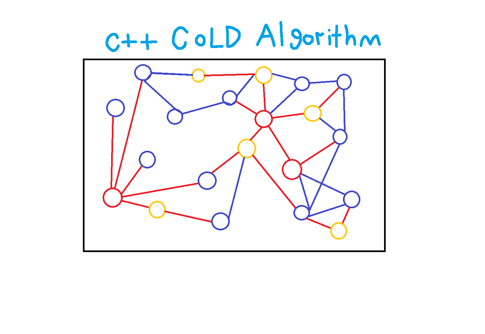
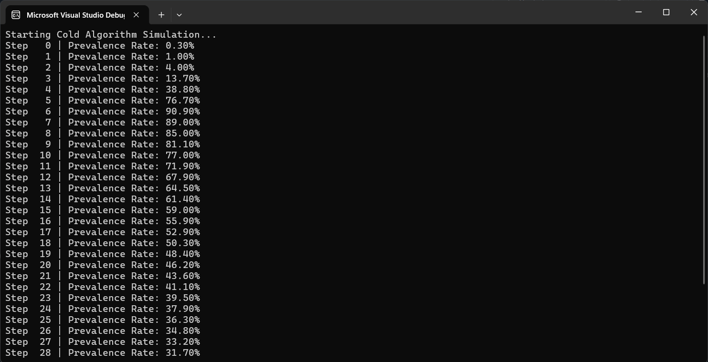

# Cold-Algorithm
Algorithm in C++ used for Simulating a cold infection , A simple simulation on a random social network, written in C++.




It's based on the classic SIR model with three states :
- Healthy
- Cold
- Removed

## Build & Run
In your local terminal run this :
```bash
g++ -O2 -o cold main.cpp
./cold
```

### Output :




### Credits :
[0xSaad](https://x.com/0xdonzdev)
